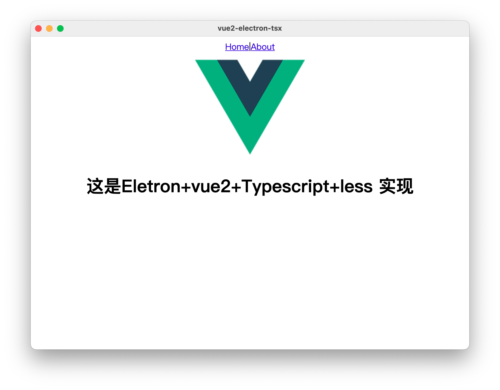

# vue2-electron-tsx

主要使用webpack构建项目，vue2的tsx语法写界面，electron构建桌面程序的解决方案


## 源码地址

[【Github地址】](https://github.com/xygengcn/vue2-electron-tsx)


## 实例



## 目录结构

- src
  - main 主进程
  - preload 注入代码
  - render 渲染进程，vue主要地方
  - utils 工具类
- dist 主进程和注入打包输出目录

## 使用 (推荐yarn)

- ### 安装依赖

```sh
yarn
```

- ### 运行

```sh
yarn run dev
```

- ### 打包
```sh
yarn run build
```


## 安装vue devtools

https://chrome.google.com/webstore/detail/vuejs-devtools/ljjemllljcmogpfapbkkighbhhppjdbg?hl=en

1、下载插件放在本地项目的拓展上，mac地址在/Users/用户名/Library/Application Support/项目名/extensions

2、如果id文件夹有版本号文件夹套着，需要把文件夹里面的文件放在第一级目录

3、安装依赖

```
yarn add electron-devtools-installer -D
```

```ts
// main.ts
import Extension from 'electron-devtools-installer'

app.whenReady().then(() => {
  const vue_devtools_beta = { id: "ljjemllljcmogpfapbkkighbhhppjdbg", electron: ">=1.2.1" }
  Extension(vue_devtools_beta)
    .then(() => { console.log('Vue-tools安装成功 \n') })
    .catch(err => {
      console.log('Vue-tools安装失败: \n', err)
    }).finally(() => {
      new createWin()
    })
});

```
